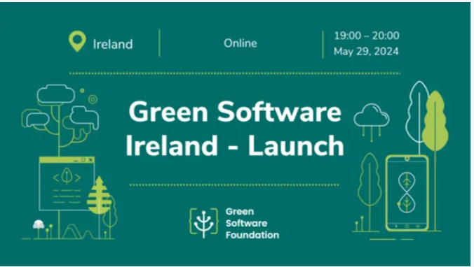

# Launch event

It was the launch event for the new community `Green Software Ireland` organized by [John B.](https://github.com/jjmax75).

| **Meeting Notes** |                                                                                             |
|-------------------|---------------------------------------------------------------------------------------------|
| **Meeting Title:**| Green Software Ireland Launch                                                                     |
| **Sponsor:**| Tixserve                                                                     |
| **Date:**         | 2024-05-29                                                                       |
| **Time:**         | 1900 - 2000                                                                     |
| **Location:**     | Google Meet                                                       |
| **Attendees:**    | 17                                                                         |
| **Note Taker:**   | [Sarvsav Sharma](https://github.com/sarvsav)                                                           |
| **Reviewer:**   | [John B.](https://github.com/jjmax75)                                                           |

## Agenda

| **Item No.** | **Agenda Item**                     | **Presenter** |
|--------------|-------------------------------------|---------------|
| 1            | Intro to Green Software Ireland                 | [John B.](https://github.com/jjmax75)        |
| 2            | Getting to know each other               | [John B.](https://github.com/jjmax75)        |
| 3            | Presentation on Greening Tixserve’s software                 | [John B.](https://github.com/jjmax75)        |
| 4            | Developing Green Software Ireland resources                 | [John B.](https://github.com/jjmax75)        |
| 5            | Next steps                 | [John B.](https://github.com/jjmax75)        |

## Discussion

| **Agenda Item**           | **Discussion Points**                                                                                      | **Presenter** | **Notes**                                 |
|---------------------------|------------------------------------------------------------------------------------------------------------|---------------|-------------------------------------------|
| Intro to Green Software Ireland       | - Overview of Green software   - Why start this community   - Feedback from Meetup group questions                                                               | [John B.](https://github.com/jjmax75)        | [Additional Notes or Comments]            |
| Getting to know each other      | - Breakout rooms   - Report back on a topic | [John B.](https://github.com/jjmax75)        | [Additional Notes or Comments]            |
| Presentation on Greening Tixserve’s software       | - Demonstration on `Impact framework`  | [John B.](https://github.com/jjmax75)        | [Additional Notes or Comments]            |
| Developing Green Software Ireland resources       | - Website & meeting notes   - Materials, Courses, and Books   - GitHub & LinkedIn                                                               | [John B.](https://github.com/jjmax75)        | [Additional Notes or Comments]            |
| Next steps       | - Getting Involved   - Future Events   | [John B.](https://github.com/jjmax75)        | [Additional Notes or Comments]            |

### Introduction to Green Software Ireland

[John B.](https://github.com/jjmax75) started with his introduction and the inspiration to build this community. The discussion continued about `sustainable development - to reduce carbon footprints`.

### Getting to know each other

We decided to split into two groups for the breakout session to connect more with each other and one person from the group should report back.
During the breakout session, we introduced to each other in smaller group and shared below things:

- What do we do?
- Where do we come from?
- What brought us here?

And, it was an interesting discussion.

### Presentation on Greening Tixserve’s software

[John B.](https://github.com/jjmax75) demonstrated on how at Tixserve they are monitoring the resources and calculating the carbon usage when customers buy the tickets with the help of impact framework. It consists of 4 steps.

1. With help of [Teads AWS plugin](https://engineering.teads.com/sustainability/carbon-footprint-estimator-for-aws-instances/), get the rough estimates of carbon footprint generated by AWS instances.
2. Calculate Software Carbon Intensity score.
3. Sum up all the carbon resources.
4. And, finally use divide to find carbon usage.

[John B.](https://github.com/jjmax75) had simulated a scenario when 80K customer buys the ticket in 3 hours, then how much carbon is generated to send the tickets to customers phone using AWS cloud service provider. The specification for the test can be found [here](https://github.com/Green-Software-Ireland/measure-tixserve-carbon/blob/main/manifests/test.yaml).

### Developing Green Software Ireland resources

#### Presentation & notes

[GitHub Repository](https://github.com/Green-Software-Ireland/measure-tixserve-carbon)

#### Books

[Building Green Software](https://www.amazon.co.uk/Building-Green-Software-Sustainable-Development/dp/1098150627) book by Anne Currie (Author), Sarah Hsu (Author), Sara Bergman (Author).

### Next steps

The baseline has been setup and we will work towards the improvements.

- Tony suggested to explore on how to obtain business values in climate change.
- Wilco suggested to discuss on how to reduce Scope 1, 2, & 3 carbon emissions.

If anyone would like to present or discuss a specific topic please let [John B.](https://github.com/jjmax75) know.

## Useful links shared in meeting chat

- [Electricity Maps](https://app.electricitymaps.com/zone/IE)
- [Grafana](https://grafana.com/)
- [Prometheus](https://prometheus.io/)
- [Green PO](https://green-po.org/)
- [Green Software for Practicioners](https://training.linuxfoundation.org/training/green-software-for-practitioners-lfc131/)
- [TAG Environment Sustainability](https://tag-env-sustainability.cncf.io/)
- [Envrionment variables podcast](https://podcast.greensoftware.foundation/)
- [Awesome Go Green](https://github.com/sarvsav/awesome-go-green)

## Thank you

Thank you for taking the step towards `Green Software`.
